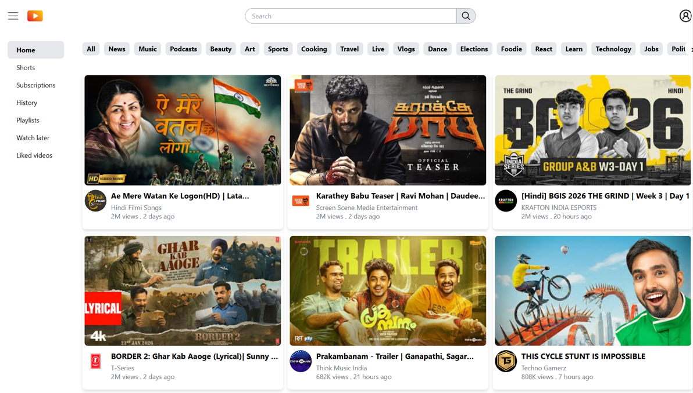
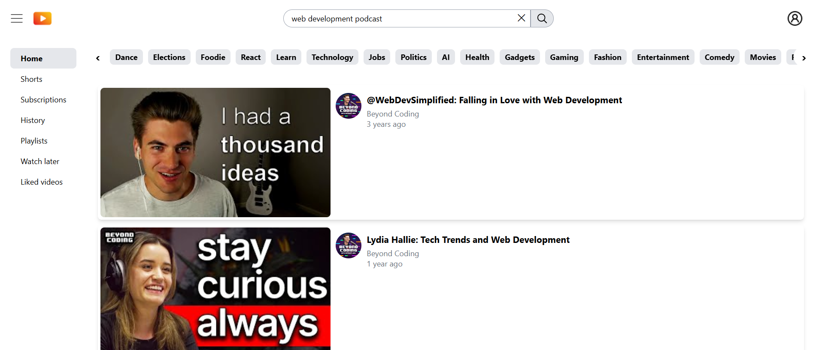

# ▶️ WatchDeck – Video Browsing Platform

WatchDeck is a responsive video browsing web application. It allows users to explore trending videos, search content with real-time suggestions, watch embedded videos, and experience interactive features like simulated live chat and offline recovery — all built with a performance-focused frontend architecture.

---

## 🔗 Live Demo

https://watchdeck.vercel.app

---

## ✨ Features

- Category-based video navigation with embedded video playback
- Real-time search with auto-suggestions powered by `YouTube APIs`
- Optimized `debounced search bar` with full keyboard navigation and clear controls
- Horizontally scrollable category navigation with button and gesture support
- `React Query` caching strategy to minimize API quota usage and improve performance.
- Offline / online detection with user notifications and seamless recovery after network interruptions
- Simulated live chat system using API polling, Redux-based message buffering and contentEditable input with character limits and warnings
- Global UI state management for sidebar toggle, chat buffer, and navigation using Redux Toolkit
- Fully responsive layouts for mobile, tablet, and desktop using Tailwind CSS
- Robust loading, error, and retry states using React Query error handling and fallback UI patterns

---

## 🛠️ Tech Stack

- React
- React Router
- Redux Toolkit
- React Query
- Tailwind CSS
- YouTube Data APIs
- OpenAI API

---

## 📸 Screenshots

### Home Page

### Search Results Page

### Watch Page

---

## 🔮 Future Improvements

- Add user authentication.
- Implement infinite scrolling for video lists and search results
- Add personalization based on viewing history and user preferences
- Implement like and save (watch later) functionality for videos.
- Add a dynamic comment system with real-time updates, threading, and moderation support

---

## 👤 Author

Anusree S Jith  
Frontend Engineer  
LinkedIn: https://www.linkedin.com/in/anusreesjith
